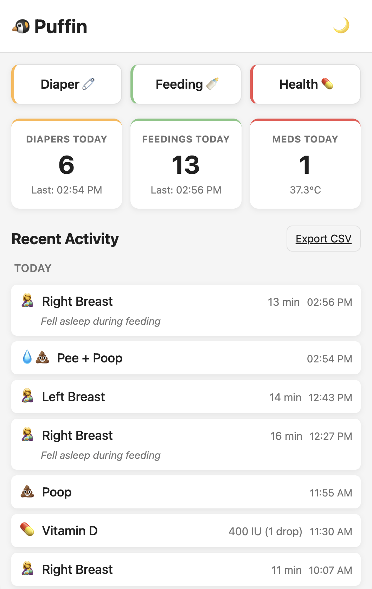
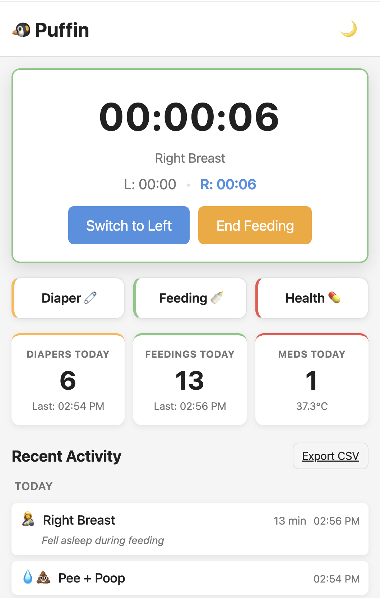
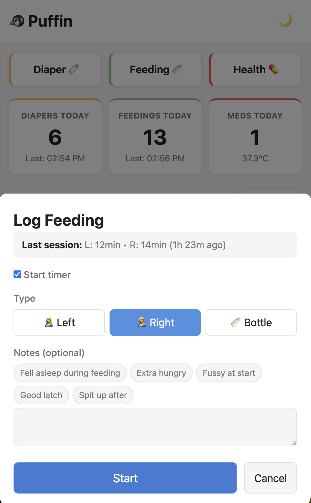

# puffin 🐦

A lightweight baby tracking dashboard for the early days. Track feedings, diapers, and health with a simple, mobile-first interface.

Self-hosted, no accounts, no cloud — just a single SQLite database.

## Screenshots

| | | | |
|---|---|---|---|
|  |  |  |  |
| Dashboard & timeline | Live feeding timer | Log a feeding | Log a diaper change |

## Features

- **Diaper Tracking** — Log pee/poop/both with quick-tap buttons
- **Feeding Tracking** — Breast (L/R) and bottle with amount in oz
- **Breastfeeding Timer** — Live timer with breast switching, persists across page refreshes, two-step end confirmation
- **Medication & Temperature** — Log meds with dosage, temps with F↔C conversion
- **Dashboard** — Today's summary, last activity timestamps, 3-day activity timeline
- **Edit & Delete** — Tap any timeline entry to edit or remove it
- **Light/Dark Mode** — Follows system preference with manual toggle
- **Data Export** — CSV and JSON export of all records
- **Mobile-First** — Large touch targets, one-handed operation
- **API Docs** — Interactive OpenAPI docs at `/docs`

## Development

### Prerequisites

- [Nix](https://nixos.org/download.html) with flakes enabled
- [devenv](https://devenv.sh/getting-started/)

### Getting Started

```bash
# Enter development environment
devenv shell

# Initialize (install dependencies)
setup

# Start development server
dev
```

Then open [http://localhost:8000](http://localhost:8000).

### Available Commands

Run these commands inside `devenv shell`:

- `setup` — Initialize the repo (install deps)
- `dev` — Start FastAPI dev server (port 8000)
- `lint` — Run ruff linter
- `lint-fix` — Run ruff linter with auto-fix
- `format` — Run ruff formatter
- `test` — Run pytest
- `seed` — Generate 14 days of realistic demo data

See `AGENTS.md` for the complete command reference including background/agent-friendly variants.

## Tech Stack

- **Backend**: Python 3.13 / FastAPI / SQLAlchemy / SQLite
- **Frontend**: Vanilla HTML/CSS/JS
- **Dev Environment**: Nix + devenv
- **Package Manager**: uv
- **Linter/Formatter**: ruff
- **Tests**: pytest with httpx TestClient

## License

BSD 3-Clause. See [LICENSE](LICENSE).
